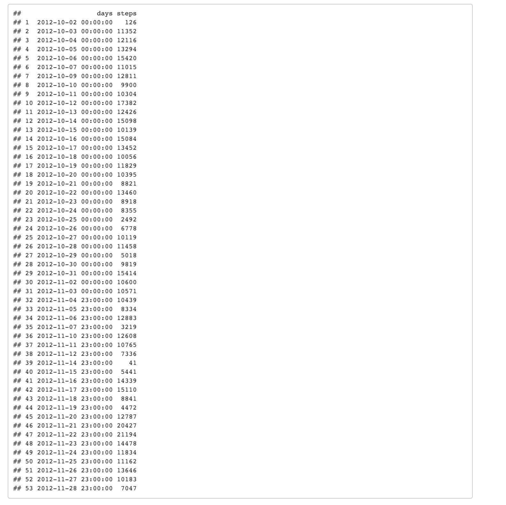

```{r setup, include=FALSE}
knitr::opts_chunk$set(echo = TRUE)
```

## Loading and preprocessing the data

### 1. Load the data
```{r}
activity <- read.csv("activity.csv")
```

### 2. Process/transform the data
```{r}
activity$date <- as.POSIXct(activity$date, format="%Y-%m-%d")
```


## What is mean total number of steps taken per day?

### 1. 
```{r}
activity_clean <- activity[complete.cases(activity),]
total_steps_per_day <- aggregate(activity_clean["steps"], 
                   list(days=cut(activity_clean$date, "1 days")),
                   sum)
total_steps_per_day
```


### 2. 
```{r}
library(ggplot2)

g <- ggplot(total_steps_per_day, aes(x = steps))
g <- g + geom_histogram() + stat_bin(aes(y=..count.., label=..count..), 
                                geom="text", vjust=-.5)
g + ggtitle("Histogram of total steps per day")
```


### 3. 

```{r}
average_steps_per_day <- aggregate(activity_clean["steps"], 
                   list(days=cut(activity_clean$date, "1 days")),
                   mean)
average_steps_per_day
```


```{r}
median_steps_per_day <- aggregate(activity_clean["steps"], 
                   list(days=cut(activity_clean$date, "1 days")),
                   median)
median_steps_per_day
```


## What is the average daily activity pattern?

### 1. 

```{r}
avg_steps_five_mins <- aggregate(steps ~ interval, data = activity_clean, mean)

plot(avg_steps_five_mins$interval, avg_steps_five_mins$steps, type="l")
lines(avg_steps_five_mins$interval, avg_steps_five_mins$steps, col="red")
```


### 2. Which 5-minute interval, on average across all the days in the dataset, 
contains the maximum number of steps?

```{r}
avg_steps_five_mins$interval[which.max(avg_steps_five_mins$steps)]
```


835, 5-minute interval, on average across all the days in the 
data set, contains the maximum number of steps.

## Imputing missing values

### 1.

```{r}
sum(is.na(activity))
```


Total number of missing rows: 2304

### 2. 

Filling missing values with the average value of the day.

### 3.

```{r}
fill_missing <- function(df1, df2) {
  n <- nrow(df1) 
  new_df <- df1

  for(i in 1:ncol(df1)){
    new_df[is.na(df1[,"steps"]), "steps"] <- mean(df1[,"steps"], na.rm = TRUE)
  }
  
  return(new_df)
}

average_steps_per_day$days <- as.POSIXct(average_steps_per_day$days, format="%Y-%m-%d")
activity_new <- fill_missing(activity, average_steps_per_day)

sum(is.na(activity_new))
```


### 4. 

```{r}
total_steps_per_day <- aggregate(activity_new["steps"], 
                   list(days=cut(activity_new$date, "1 days")),
                   sum)
head(total_steps_per_day)
```


```{r}
g <- ggplot(total_steps_per_day, aes(x = steps))
g <- g + geom_histogram() + stat_bin(aes(y=..count.., label=..count..), 
                                geom="text", vjust=-.5)
g + ggtitle("Histogram of total steps per day")
```


```{r}
average_steps_per_day <- aggregate(activity_new["steps"], 
                   list(days=cut(activity_new$date, "1 days")),
                   mean)
head(average_steps_per_day)
```


```{r}
median_steps_per_day <- aggregate(activity_new["steps"], 
                   list(days=cut(activity_new$date, "1 days")),
                   median)
median_steps_per_day
```


The imputed dates now have different median values, also the mean
of each day has changed after imputing missing values.

## Are there differences in activity patterns between weekdays and weekends?


### 1.

```{r}
activity$weekday <- ifelse(weekdays(activity$date) == "Saturday" | weekdays(activity$date) == "Sunday", "Weekend", "Weekday")
```


### 2.

```{r}
g <- ggplot(activity, aes(x = interval, y = steps))
g <- g + geom_line() + facet_grid(vars(weekday))
g
```


